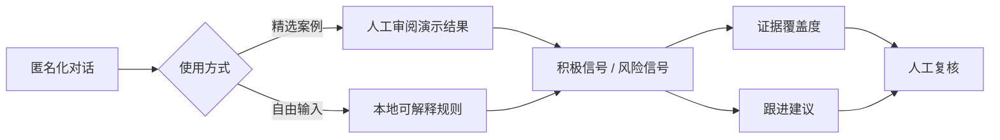

# Signal Copilot｜招聘沟通信号分析助手

一个面向招聘沟通场景的中英文双语交互原型：帮助求职者理解面试推进信号，也帮助招聘方识别候选人接受 Offer 前的沟通风险。

**[在线体验 Signal Copilot](https://zoezhuy.github.io/signal-copilot/)**

> 这是作品集项目，不是自动化招聘决策系统。产品只分析对话中的可观察信号，不评价候选人的能力、性格或“是否值得录用”。

## 项目亮点

- **双角色视角**：求职者模式关注面试推进；招聘方模式关注候选人参与度及 Offer 接受风险。
- **证据可追溯**：结果包含信号名称、原文证据、证据覆盖度和下一步建议。
- **中英文体验**：界面、示例对话和分析输出均支持中文与英文。
- **可解释演示**：精选案例使用人工审阅的演示输出；自由输入使用浏览器本地规则引擎，不上传或存储文本。
- **负责任 AI**：加入个人信息提醒、证据不足状态、人工复核声明和非决定性设计。
- **多端概念验证**：支持桌面布局及 390px 小程序形态预览（不是原生微信小程序实现）。

## 产品演示流程

1. 选择求职者或招聘方模式。
2. 选择一个示例，或粘贴已匿名化的对话。
3. 查看积极信号、风险信号及对应原文证据。
4. 根据建议改善下一次沟通，而不是把分析结果作为最终决定。



## 当前实现范围

| 能力 | 状态 | 说明 |
|---|---:|---|
| 中英文界面 | ✅ | 支持完整切换，示例内容同步更新 |
| 求职者/招聘方双模式 | ✅ | 两套目标、信号与建议逻辑 |
| 精选示例分析 | ✅ | 12 组人工编写结果：2 种语言 × 2 种模式 × 3 类情境 |
| 自由文本分析 | ✅ Prototype | 本地关键词规则，提供可解释证据；不是大模型调用 |
| 联系方式提醒 | ✅ Prototype | 检测常见邮箱、电话、微信或 LinkedIn 格式 |
| 微信小程序 | Concept only | 当前仅为 Web 中的手机尺寸预览 |
| LLM / ATS 集成 | 未实现 | 见下方路线图 |

## 本地运行

环境要求：Node.js 22.12+ 或 24+。

```bash
npm install
npm run dev
```

生产构建：

```bash
npm run build
npm run preview
```

自动化验证：

```bash
npm test
npm run check
```

## 技术栈

- React 18 + TypeScript
- Vite + Tailwind CSS
- lucide-react
- 纯前端本地分析；无 API key、无服务端数据存储

## 发布到 GitHub Pages

1. 将项目推送到 GitHub 仓库的 `main` 分支。
2. 打开 **Settings → Pages**。
3. 在 **Build and deployment** 中将 **Source** 选为 **GitHub Actions**。
4. `.github/workflows/deploy.yml` 会自动测试、构建并发布 `dist` 目录。

Vite 资源路径已设置为相对路径，因此不需要预先知道 GitHub 仓库名称。

## 设计与研究文档

- [完整案例研究](docs/CASE_STUDY.zh-CN.md)
- [招聘沟通信号框架](docs/SIGNAL_FRAMEWORK.md)
- [负责任 AI 与隐私原则](docs/RESPONSIBLE_AI.md)
- [简历文案与面试讲述稿](docs/PORTFOLIO_COPY.zh-CN.md)

## 质量保证

- Vitest 覆盖积极信号、风险信号、证据不足和个人信息提醒。
- GitHub Actions 在推送及 Pull Request 时执行测试、TypeScript 检查和生产构建。
- `package-lock.json` 锁定已验证的依赖版本。

## 关键设计取舍

### 为什么不用“录用概率”或“入职概率”？

一段聊天无法可靠预测人的最终行为。产品因此展示“证据覆盖度”，并把结论限制在沟通信号层面，以减少虚假的精确感。

### 为什么保留规则引擎？

规则引擎让 GitHub 访客无需 API key 即可体验自由输入，也便于审查每个结论如何产生。它是交互与信号框架验证工具，不被包装成生产级 AI。

## 已知限制

- 不理解复杂语境、反讽、跨消息关系或公司特定招聘流程。
- 不能仅凭文本可靠判断回复延迟；需要结构化时间戳数据。
- 关键词匹配可能产生误报或漏报。
- 示例结果用于呈现产品形态，不代表模型效果评估。
- 联系方式检测只是提醒，不等同于完整的数据脱敏方案。

## 下一阶段路线图

1. 定义结构化 JSON 输出协议及带引用证据的服务端分析接口。
2. 增加时间戳、说话人和招聘阶段字段，支持回复延迟等序列信号。
3. 建立匿名标注集，由招聘从业者评估信号准确性、建议可用性和潜在伤害。
4. 加入自动脱敏、数据删除策略、访问控制和审计记录。
5. 开展中英文、公平性和低置信度场景测试。

## 项目结构

```text
src/
  analysisEngine.ts       # 可解释的本地演示规则
  components/             # 输入、结果、导航与方法说明
  i18n.ts                 # 中英文产品文案与示例
  mockResults.ts          # 人工审阅的精选案例结果
docs/
  CASE_STUDY.zh-CN.md     # 产品案例研究
  SIGNAL_FRAMEWORK.md     # 信号定义与边界
  RESPONSIBLE_AI.md       # 风险、隐私和人工复核原则
  PORTFOLIO_COPY.zh-CN.md # 求职使用文案
```

## 使用声明

本项目仅用于产品设计与作品集演示。请勿输入真实候选人的敏感个人信息，也不要将输出用于自动筛选、拒绝候选人或其他高影响就业决策。
